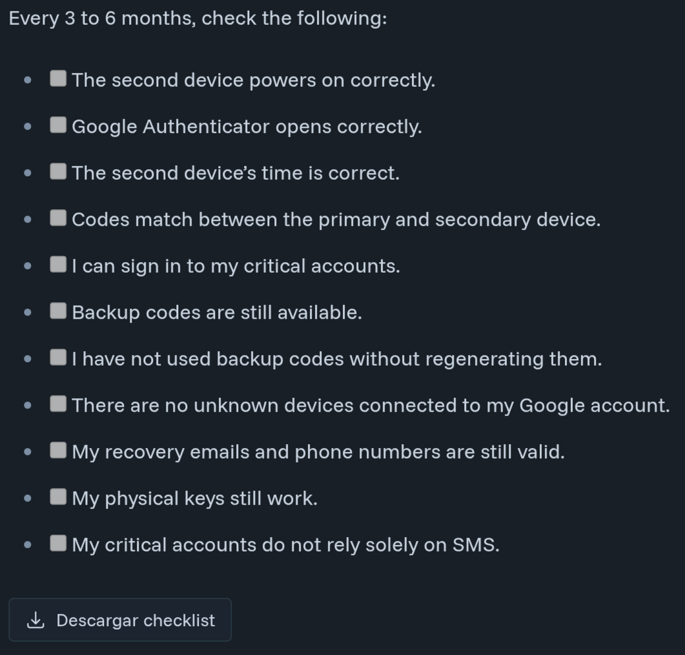

# astro-downloadchecklist

[](https://opensource.org/licenses/Apache-2.0)


[](https://github.com/rgglez/astro-downloadchecklist/releases/)


**astro-downloadchecklist** allows users to download a checklist wrapped with this
component as a CSV file.

One use case is a blog post (Markdown or MDX), where you can download a
checklist directly from the page.



## Installation

```bash
npm install @rgglez/astro-downloadchecklist
```

## Usage

Import the component:

```mdx
import DownloadChecklist from "@/components/DownloadChecklist.astro";
```

Wrap a checklist with the component.

```mdx
<DownloadChecklist filename="initial-setup-checklist.csv" label="Download">
- [ ] I identified my critical accounts.
- [ ] I installed Google Authenticator on the primary device.
- [ ] I installed Google Authenticator on the secondary device.
- [ ] I enabled strong locks on both devices.
- [ ] I decided whether to use Google account synchronization.
- [ ] I copied the TOTP accounts to the second device.
- [ ] I compared codes on both devices.
- [ ] I tested a real login with the second device.
- [ ] I downloaded or printed backup codes for each critical service.
- [ ] I stored backup codes outside the main phone.
- [ ] I reviewed my Google account recovery methods.
- [ ] I reviewed active sessions and connected devices.
- [ ] I registered passkeys or physical keys where possible.
- [ ] I documented the date of the last test.
</DownloadChecklist>
```

Now, when you view the rendered MDX or Markdown in the browser, you'll see a
download button. Clicking it will download the checklist in CSV format.

### Properties

| Name | Value |
|------|------|
| `filename` | The default name of the file to download |
| `label` | The text for the download button (Default: "Download checklist") |

## Development

| Target | Description |
|--------|-------------|
| `make tags` | List git tags sorted by semver (descending) |
| `make latest-tag` | Show the latest git tag |
| `make patch` | Bump PATCH version in `package.json`, commit, tag, and push |
| `make publish` | Publish current version to npm |

Typical release flow: `make patch publish`.

## License

Copyright (C) 2026 Rodolfo González González.

Licensed under the [Apache v2.0](https://www.apache.org/licenses/LICENSE-2.0.txt).
Read the [LICENSE](LICENSE) file.
